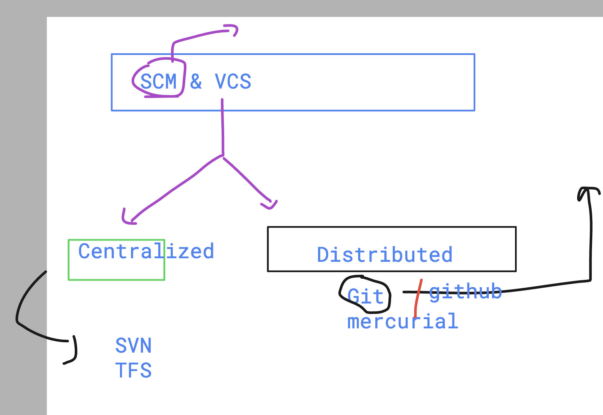
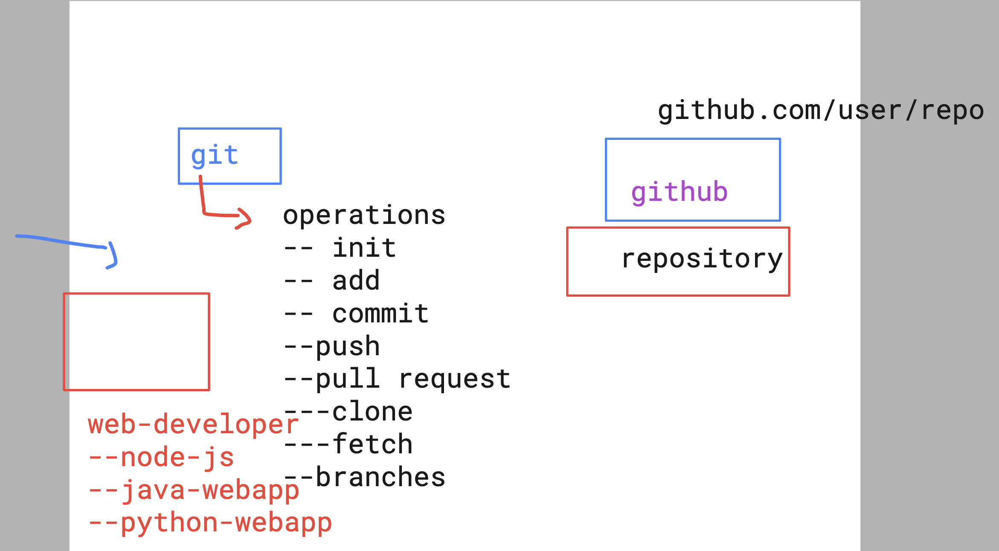
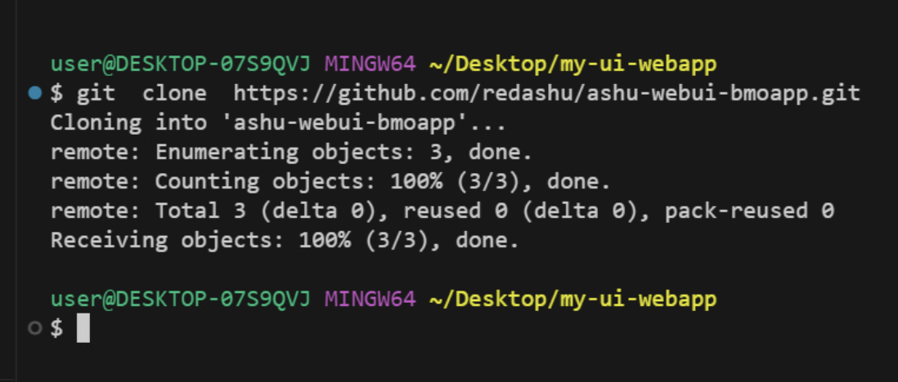
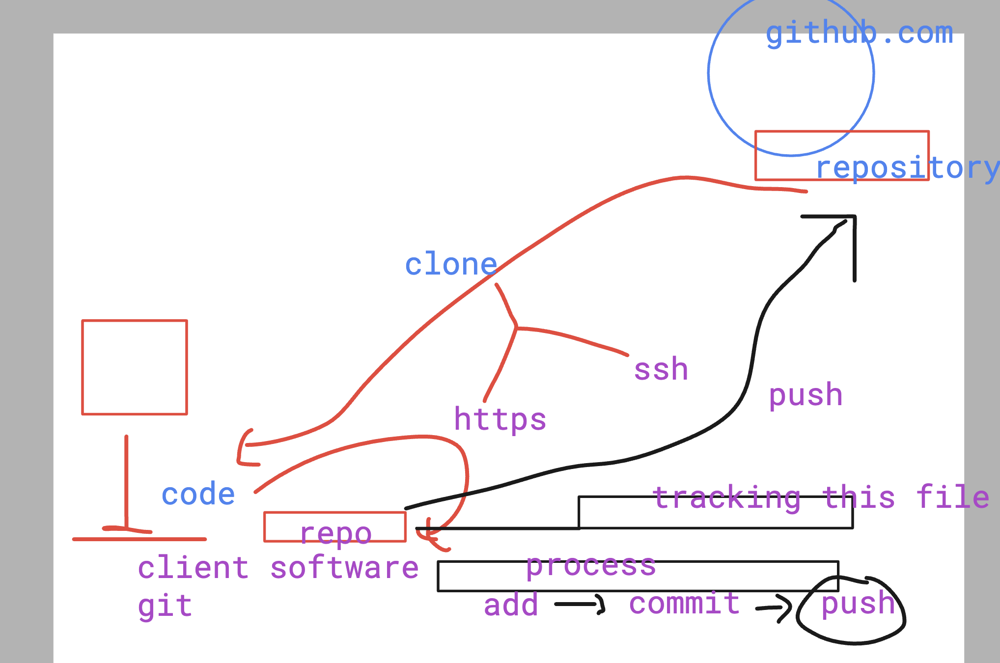

# BMO-devsecops

## lab access methods

### understanding devops life cyle 

### scm & vcs 

### creating git repo

### cloning repo from github to local system 

### pushing code to remote repo 

