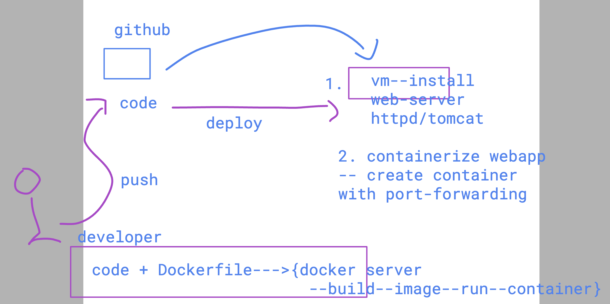
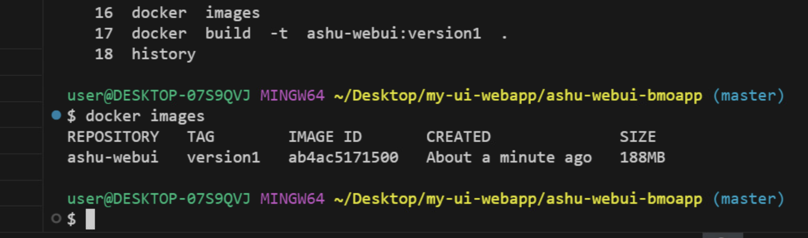
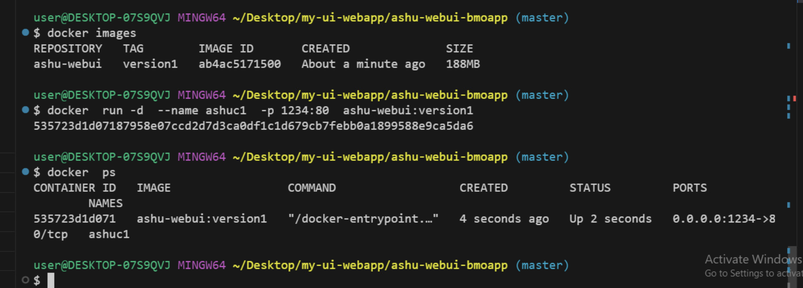

# BMO-devsecops

## lab access methods

### understanding devops life cyle 

### scm & vcs 

### creating git repo

### cloning repo from github to local system 

### pushing code to remote repo 

## to test app we got 2 options 

## build docker image 

### creating container 

