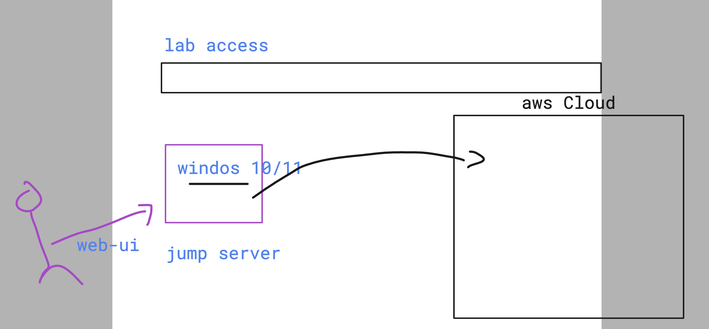
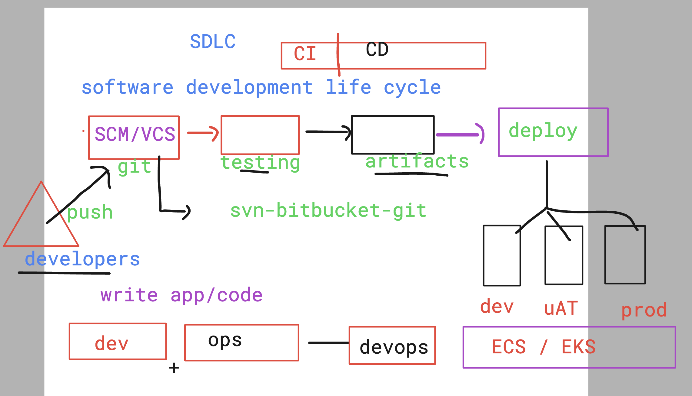
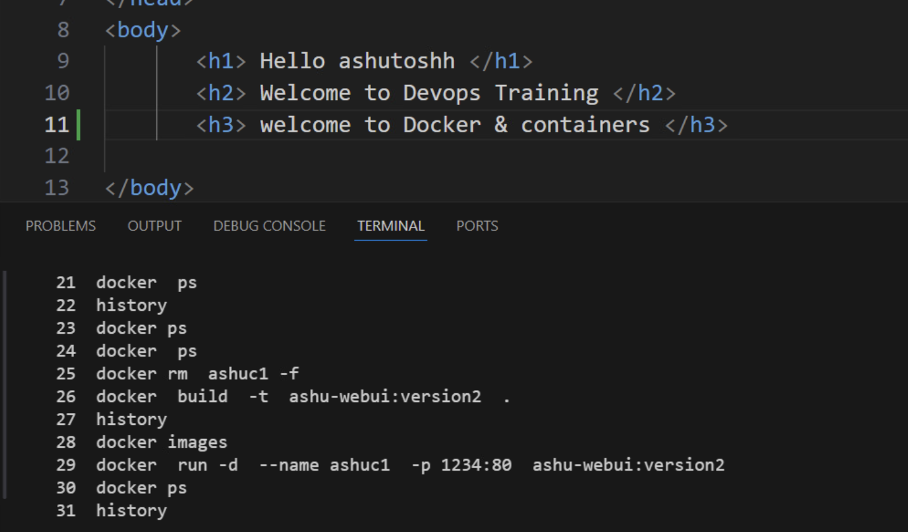
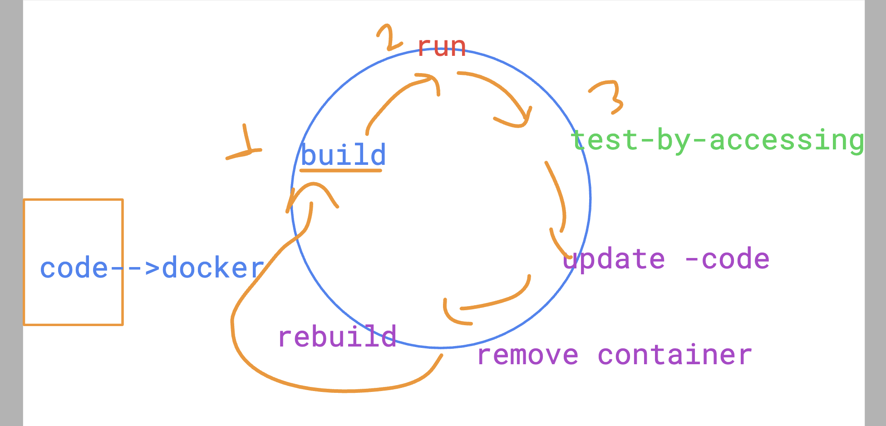
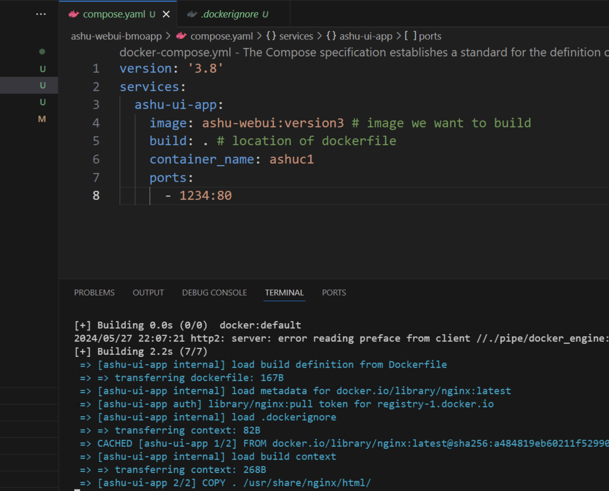

# BMO-devsecops

## lab access methods

### understanding devops life cyle 

### scm & vcs 

### creating git repo

### cloning repo from github to local system 

### pushing code to remote repo 

## to test app we got 2 options 

## build docker image 

### creating container 

### application upgrade required below steps

- removal of existing containers
- rebuild docker image
- recreate container from new image 
- test app by accessing it 

### app container upgrade life cycle 

### use of docker compose to automate

### compose file example 

