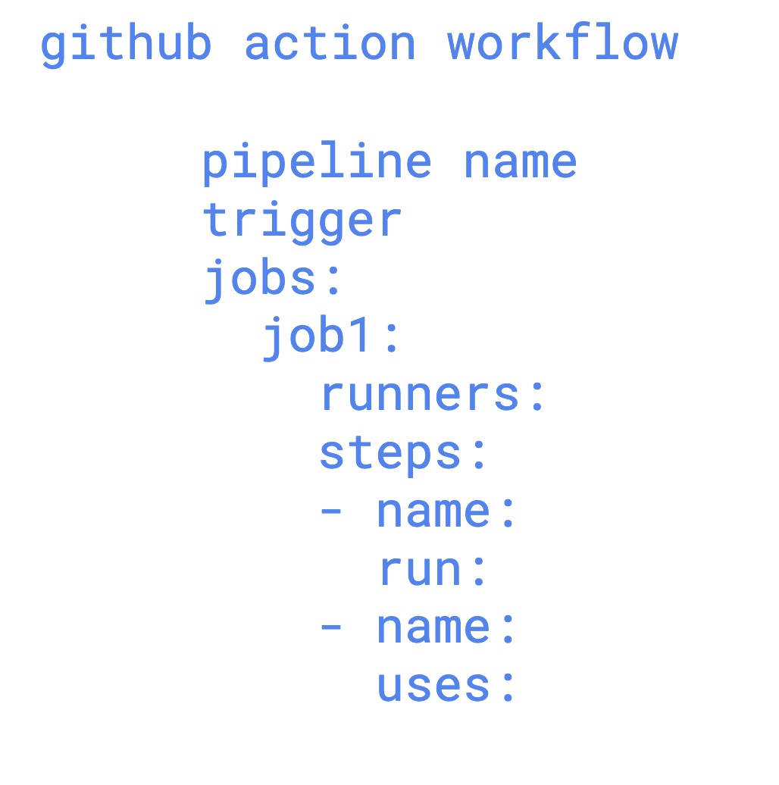
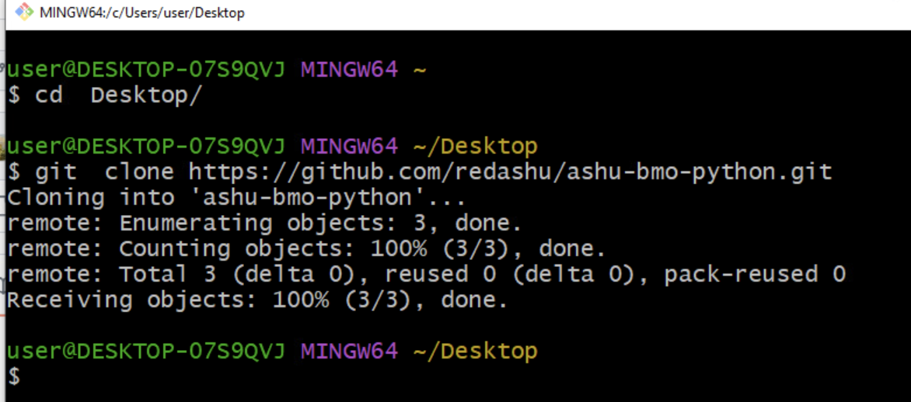
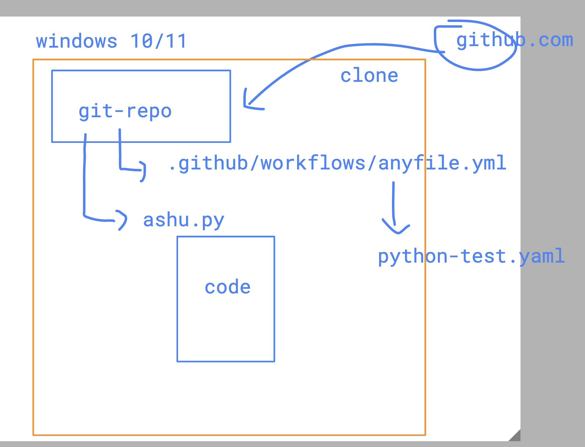
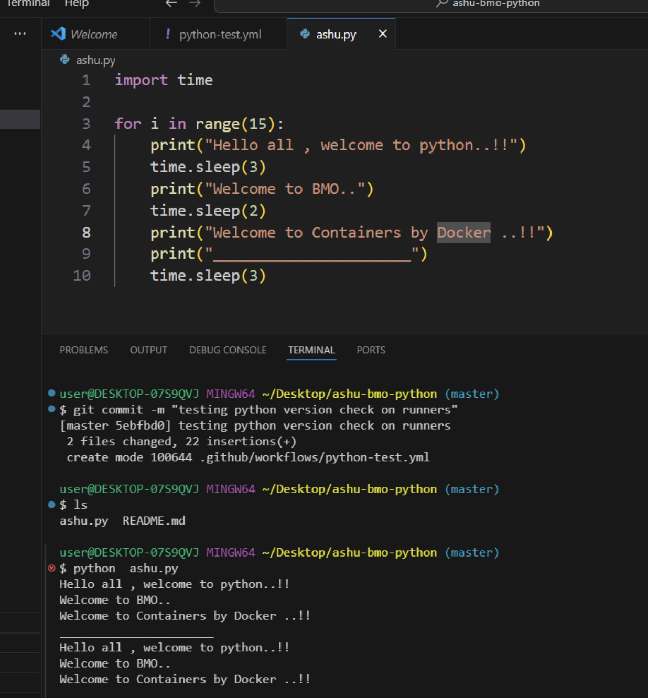
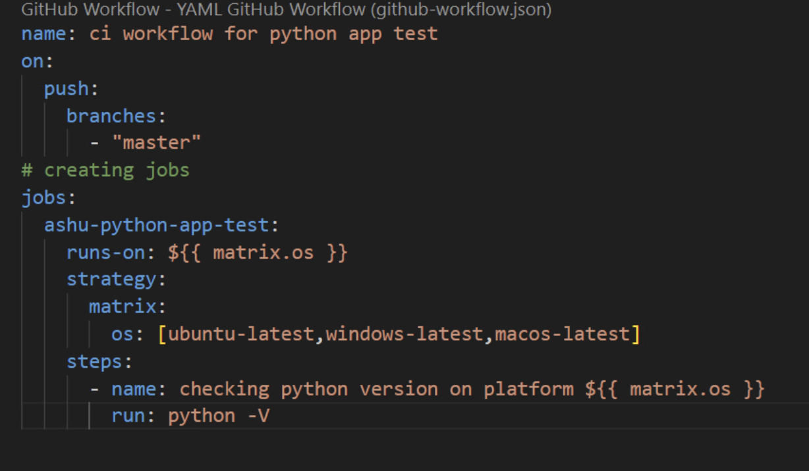
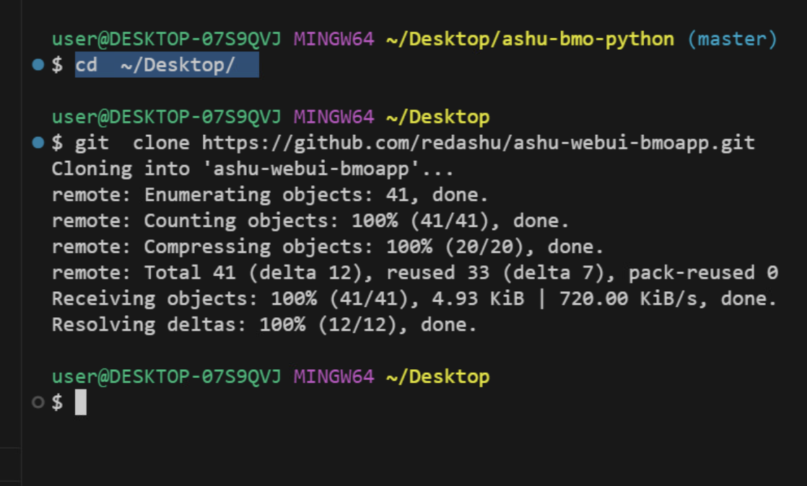
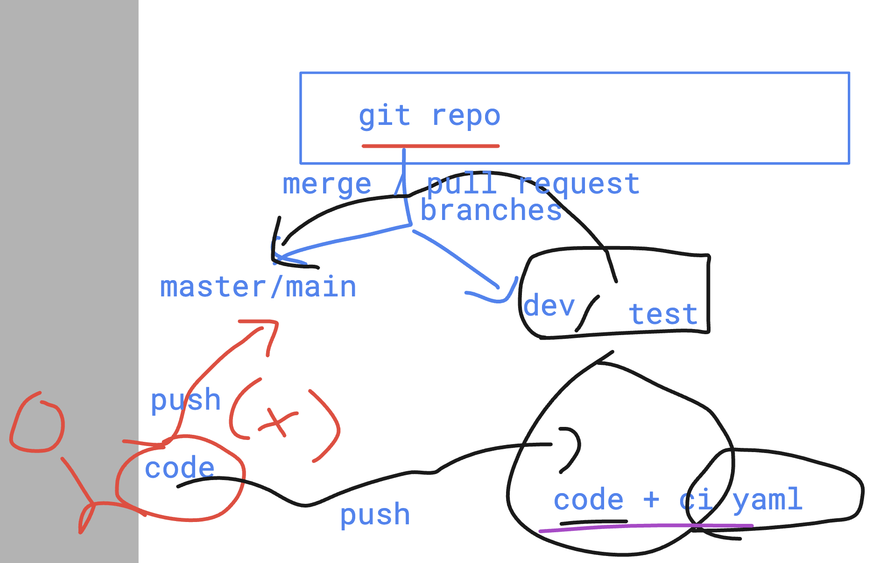

# BMO-devsecops

### github workflow format for ci tool 

## Understanding multiple runners and using it for python code testing

### github repo -- to github actions 

## testing python code on dev machine 

## github action file to run test on multiple platform 

### back to webapp from day1

### understanding branch in git repo

