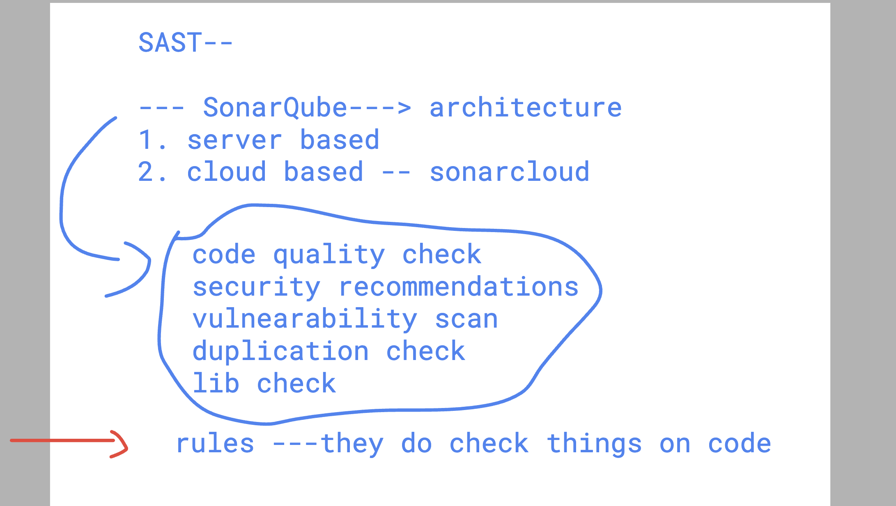

# BMO-devsecops

### github workflow format for ci tool 

## Understanding multiple runners and using it for python code testing

### github repo -- to github actions 

## testing python code on dev machine 

## github action file to run test on multiple platform 

### back to webapp from day1

### understanding branch in git repo

### Creating branch from master to dev 

### pipeline to push image of containers to docker hub 

### to search workflows for github actions -- try github market place

[click_here](https://github.com/marketplace/)

### workflow for pushing image to docker hub 

### pushing code to dev branch 

### pipeline changes from devops to devsecops 

### understandign SAST & DAST -- with pre & post build 

## SAST options 

- trivy -- 
[click_here](https://github.com/aquasecurity/trivy)

- trufflehog
[click_here](https://github.com/trufflesecurity/trufflehog)
- sonarqube 
- snyk 
- codeQL

## Introduction to sonarqube 

### basic info

### architecture 

### more understanding 

