# BMO-devsecops

### revision for devsecops pipeline 

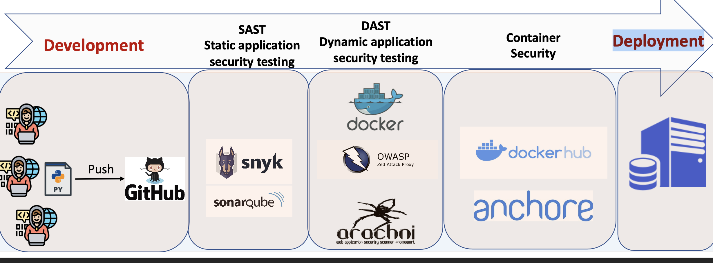

### starting custom runner on windows 

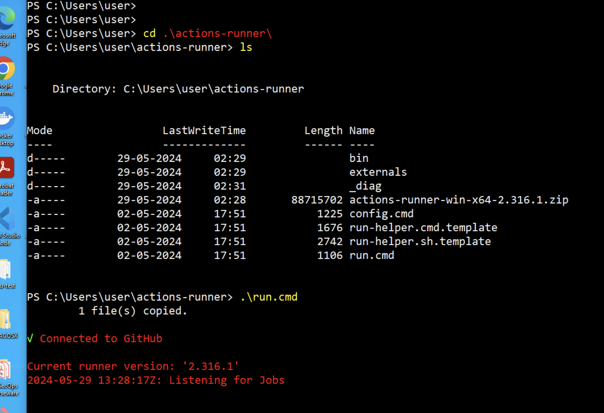

### understanding mulitple jobs 

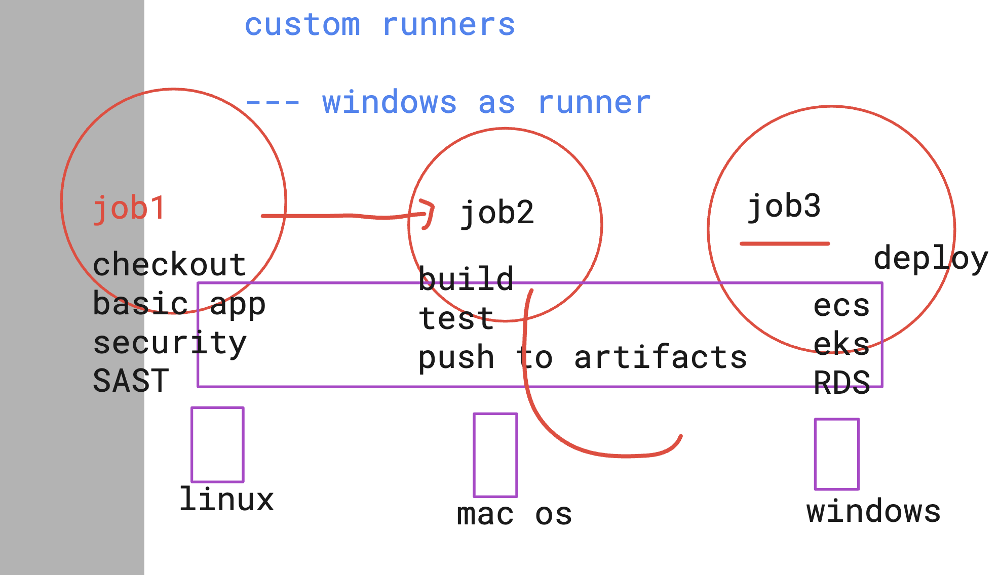

### incase windows machine have execution policy disable 

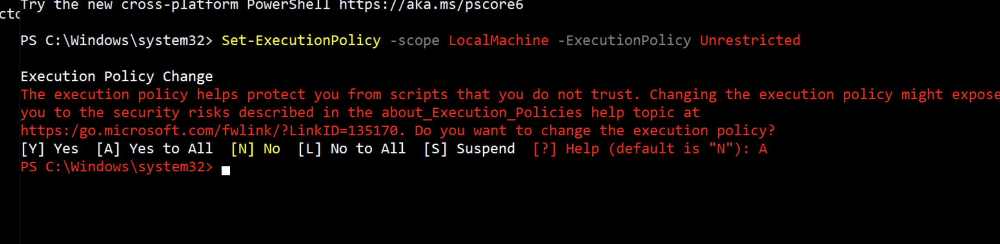

### multip job demo project

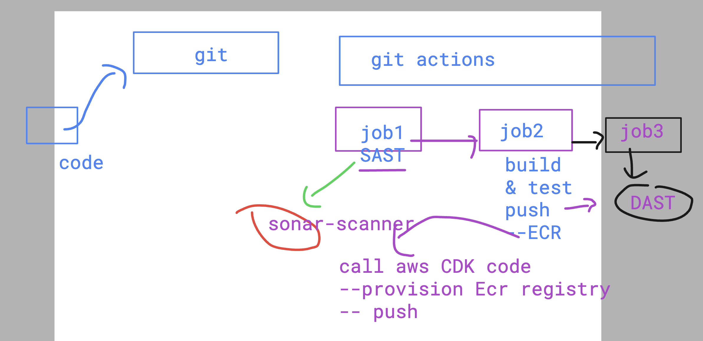

### pushing docker image to ECR for better security 

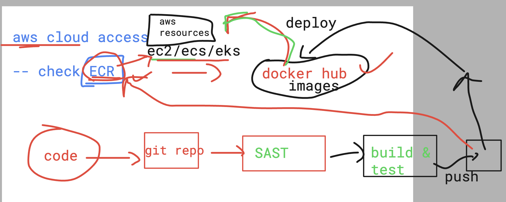

### pushing image to ECR from local system 

- step 1 -- use aws configure and do the needful
- step 2 -- tag docker image to ECR format
- step 3 -- login to ECR from local machine using docker cli 
- step 4 - push docker image to ECR 

### aws configure & docker tag 

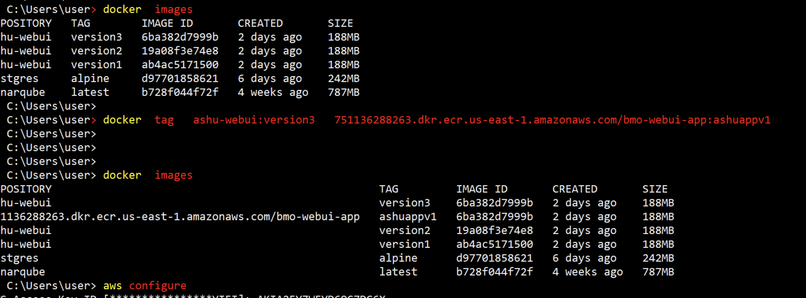
### login ECR from docker cli and push 

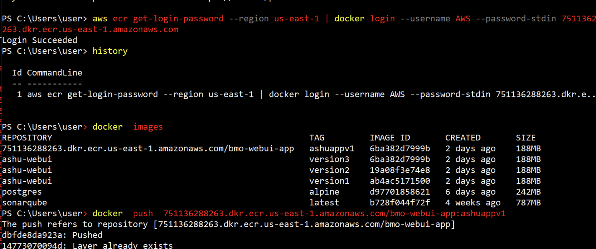

### secret managers for developers to store confidentail info 

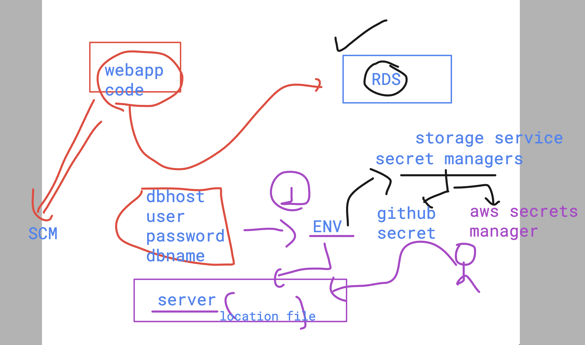

### try cdk to create ECR 

### understanding DAST location and usage

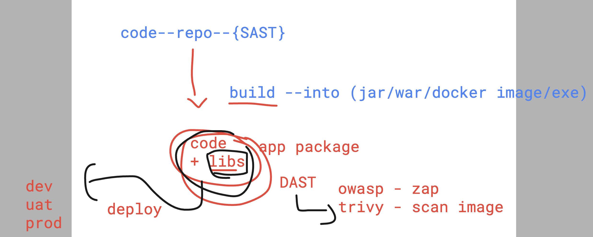

### image scanning 

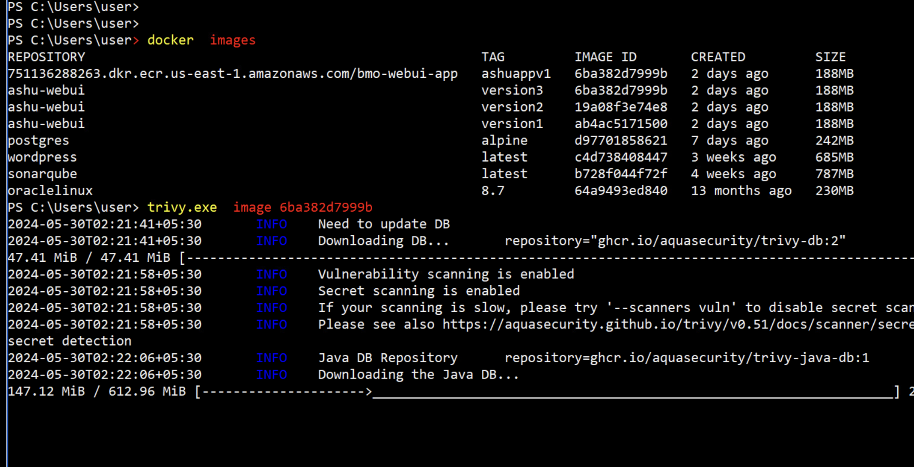

