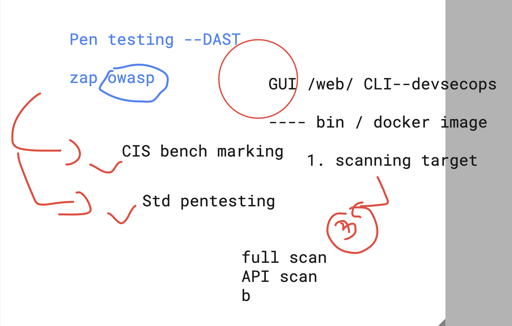

# BMO-devsecops

## security level 


### understanding webapp to db security and attack plane


### python flask commands with compose 


### zap security 



### scanning a running webapp using zap full scan script 

```
docker  run   -it ghcr.io/zaproxy/zaproxy:stable zap-full-scan.py -t  http://34.239.134.77/
```

### creating ns 

```
humanfirmware@darwin  ~/Desktop  kubectl  create  ns  ashu-space
namespace/ashu-space created
 humanfirmware@darwin  ~/Desktop  kubectl get  ns
NAME              STATUS   AGE
ashu-space        Active   8s
default           Active   10h
kube-node-lease   Active   10h
kube-public       Active   10h
kube-system       Active   10h

```

### creating deployment of webapp 

```
kubectl create  deployment ashu-web --port 80 --image=dockerashu/ashubmoweb:bmovd760216fcd40ff91919aa699add67451ff8d185d  --dry-run=client -o yaml >deploy.yml 
 humanfirmware@darwin  ~/Desktop  kubectl create -f deploy.yml -n ashu-space 
deployment.apps/ashu-web created
 humanfirmware@darwin  ~/Desktop  kubectl  get deploy -n ashu-space
NAME       READY   UP-TO-DATE   AVAILABLE   AGE
ashu-web   1/1     1            1           23s
 humanfirmware@darwin  ~/Desktop  kubectl  get po -o wide -n ashu-space
NAME                        READY   STATUS    RESTARTS   AGE   IP               NODE                             NOMINATED NODE   READINESS GATES
ashu-web-7b5f7874d8-ctkcn   1/1     Running   0          36s   192.168.25.136   ip-192-168-25-241.ec2.internal   <none>           <none>
 humanfirmware@darwin  ~/Desktop  kubectl get no
NAME                              STATUS   ROLES    AGE   VERSION
ip-192-168-125-128.ec2.internal   Ready    <none>   8h    v1.29.3-eks-ae9a62a
ip-192-168-25-241.ec2.internal    Ready    <none>   8h    v1.29.3-eks-ae9a62a
ip-192-168-55-26.ec2.internal     Ready    <none>   8h    v1.29.3-eks-ae9a62a
```

### creating external LB to access webapp

```
kubectl get deploy -n ashu-space 
NAME       READY   UP-TO-DATE   AVAILABLE   AGE
ashu-web   1/1     1            1           78s
 humanfirmware@darwin  ~/Desktop  
 humanfirmware@darwin  ~/Desktop  kubectl expose deploy  ashu-web --type LoadBalancer --port 80 --name ashulb1  -n ashu-space  --dry-run=client -o yaml  >service.yml
 humanfirmware@darwin  ~/Desktop  kubectl create -f service.yml 
service/ashulb1 created
 humanfirmware@darwin  ~/Desktop  kubectl get po,svc -n ashu-space
NAME                            READY   STATUS    RESTARTS   AGE
pod/ashu-web-7b5f7874d8-ctkcn   1/1     Running   0          2m21s

NAME              TYPE           CLUSTER-IP       EXTERNAL-IP                                                              PORT(S)        AGE
service/ashulb1   LoadBalancer   10.100.203.154   a2fcf955873004357bca23ac032b7600-577445673.us-east-1.elb.amazonaws.com   80:30507/TCP   12s
 humanfirmware@darwin  ~/Desktop  

```


